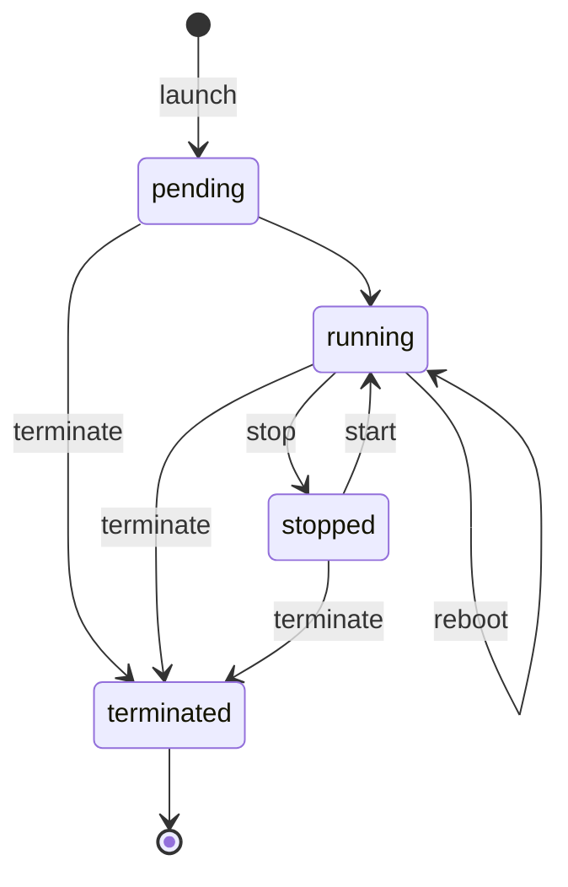

# 狀態轉移表 — 範本與完整範例

狀態轉移表是 FSM 優先方法的核心。在撰寫任何端點之前先建好它。每一格回答：
*「資源能否從『列狀態』移動到『欄狀態』？若可以，是哪個領域動詞觸發（且誰可以做）？」*

## 範本 1 — 資源與狀態

```
受控對象（controlled object）：<一個名詞，例如 Instance>
範圍（一行）：                  <這個 API 做什麼／不做什麼>

狀態（≤10，理想約 5 個）：
  - <state-1>   (INITIAL)
  - <state-2>
  - <state-3>
  - <state-4>   (END)
  - <state-5>   (END)
```

## 範本 2 — 轉移表

列＝目前（從）狀態。欄＝目標（到）狀態。
格＝`動詞`（允許）或 ❌（禁止）。視需要加上「角色」欄或註記。

```
            | to: A        | to: B        | to: C        | to: D
------------+--------------+--------------+--------------+--------------
from: A     | —            | verbAB       | ❌           | ❌
from: B     | ❌           | —            | verbBC       | verbBD
from: C     | ❌           | verbCB       | —            | verbCD
from: D     | ❌           | ❌           | ❌           | —  (END)
```

角色（逐轉移）：
```
verbAB : <允許的角色>
verbBC : <允許的角色>
...
```

## 範本 3 — 端點對應

為每個允許的動詞寫一列：

```
轉移（從→到）         | 動詞     | HTTP 方法 + 路徑               | 角色
---------------------+----------+-------------------------------+--------------
(none)→A             | create   | POST   /resources             | ...
A→B                  | verbAB   | POST   /resources/{id}:verbAB | ...
B→D                  | verbBD   | DELETE /resources/{id}        | ...
```

---

## 完整範例 — EC2 執行個體（Instance）

**受控對象：** Instance
**範圍：** 管理單一 VM 的運算生命週期；*不*管理計費或網路。

**狀態：** `pending`（INITIAL）、`running`、`stopped`、`terminated`（END）

**轉移表**（動詞＝允許，❌＝禁止）：

```
              | running   | stopped   | terminated
--------------+-----------+-----------+-----------
pending       | (auto)    | ❌        | terminate
running       | reboot*   | stop      | terminate
stopped       | start     | ❌        | terminate
terminated    | ❌        | ❌        | —  (END)
```
`*reboot` 為 running→running（自轉移）。

**推導出的端點：**

```
轉移                | 動詞       | HTTP
--------------------+------------+----------------------------
(none)→pending      | launch     | POST   /instances
pending→running     | (auto)     | （無端點——自動）
running→stopped     | stop       | POST   /instances/{id}:stop
stopped→running     | start      | POST   /instances/{id}:start
running→running     | reboot     | POST   /instances/{id}:reboot
*→terminated        | terminate  | DELETE /instances/{id}
read / list         | —          | GET /instances , GET /instances/{id}
```

注意*缺少*了什麼：沒有辦法去 `start` 一個 `running` 的執行個體，也沒辦法 `stop` 一個
`terminated` 的執行個體。轉移表禁止這些轉移，所以 API 從不開放它們。這正是重點所在。

## 選用 — Mermaid 狀態圖


