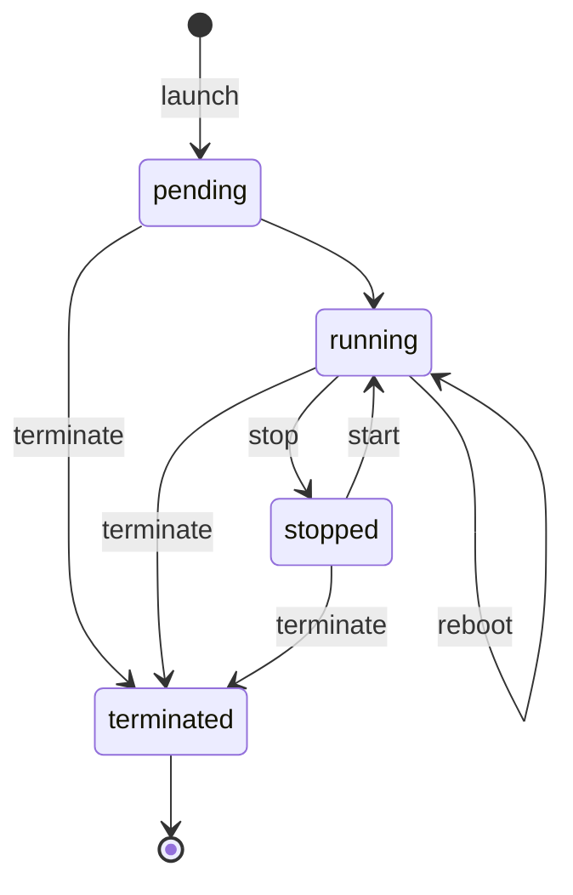

# State Transition Table — Templates & Worked Example

The state transition table is the heart of the FSM-first method. Build it before
writing any endpoint. Each cell answers: *"Can the resource move from row-state
to column-state, and if so, what domain verb triggers it (and who may do it)?"*

## Template 1 — Resource & states

```
Resource (controlled object): <one noun, e.g. Instance>
Scope (one line):             <what this API does / does not do>

States (≤10, ideally ~5):
  - <state-1>   (INITIAL)
  - <state-2>
  - <state-3>
  - <state-4>   (END)
  - <state-5>   (END)
```

## Template 2 — Transition table

Rows = current (from) state. Columns = target (to) state.
Cell = `verb` (allowed) or ❌ (forbidden). Add a Roles column/note as needed.

```
            | to: A        | to: B        | to: C        | to: D
------------+--------------+--------------+--------------+--------------
from: A     | —            | verbAB       | ❌           | ❌
from: B     | ❌           | —            | verbBC       | verbBD
from: C     | ❌           | verbCB       | —            | verbCD
from: D     | ❌           | ❌           | ❌           | —  (END)
```

Roles (per transition):
```
verbAB : <role(s) allowed>
verbBC : <role(s) allowed>
...
```

## Template 3 — Endpoint mapping

For every allowed verb, write one row:

```
Transition (from→to) | Verb     | HTTP method + path            | Roles
---------------------+----------+-------------------------------+--------------
(none)→A             | create   | POST   /resources             | ...
A→B                  | verbAB   | POST   /resources/{id}:verbAB | ...
B→D                  | verbBD   | DELETE /resources/{id}        | ...
```

---

## Worked example — EC2 Instance

**Controlled object:** Instance
**Scope:** manage the compute lifecycle of a single VM; does *not* manage
billing or networking.

**States:** `pending` (INITIAL), `running`, `stopped`, `terminated` (END)

**Transition table** (verb = allowed, ❌ = forbidden):

```
              | running   | stopped   | terminated
--------------+-----------+-----------+-----------
pending       | (auto)    | ❌        | terminate
running       | reboot*   | stop      | terminate
stopped       | start     | ❌        | terminate
terminated    | ❌        | ❌        | —  (END)
```
`*reboot` is running→running (self-transition).

**Derived endpoints:**

```
Transition          | Verb       | HTTP
--------------------+------------+----------------------------
(none)→pending      | launch     | POST   /instances
pending→running     | (auto)     | (no endpoint — automatic)
running→stopped     | stop       | POST   /instances/{id}:stop
stopped→running     | start      | POST   /instances/{id}:start
running→running     | reboot     | POST   /instances/{id}:reboot
*→terminated        | terminate  | DELETE /instances/{id}
read / list         | —          | GET /instances , GET /instances/{id}
```

Note what's *absent*: there's no way to `start` a `running` instance or
`stop` a `terminated` one. The table forbids those transitions, so the API
never exposes them. That is the whole point.

## Optional — Mermaid state diagram


